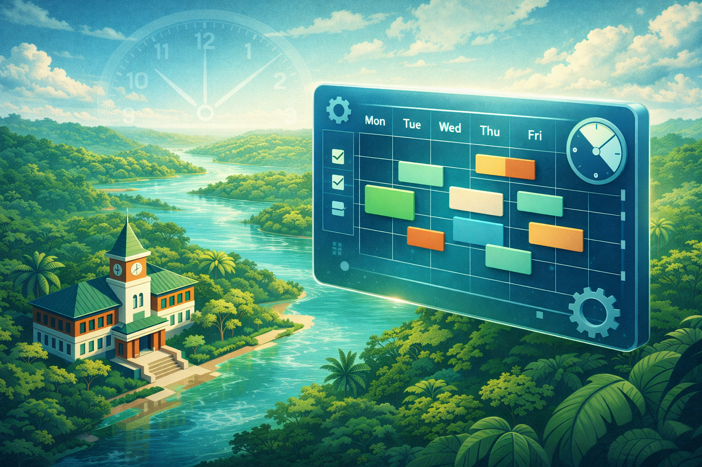

# Gestor de Alocação de Carga Horária - IECOS/UFPA



Sistema web para gestão, alocação e visualização de grades horárias acadêmicas. Desenvolvido para facilitar o trabalho dos diretores de faculdade e da secretaria acadêmica do IECOS/UFPA.

🔗 **Acesse o Sistema:** [CLIQUE AQUI PARA ACESSAR](https://astuciasnor.github.io/gestor-iecos/)

📘 **Manual Completo:** [`docs/MANUAL.md`](docs/MANUAL.md)

---

## 🎯 Funcionalidades

* **Visualização Gráfica:** Grade semanal interativa e Calendário Mensal acadêmico.
* **Controle de Carga Horária:** Contagem automática de horas alocadas vs. horas da disciplina.
* **Detector de Conflitos:** Identifica visualmente se um professor foi alocado em duas turmas no mesmo horário (mesmo entre faculdades diferentes).
* **Integração:** Permite mesclar arquivos de diferentes diretores para uma visão unificada.
* **Impressão:** Geração de PDFs formatados para mural e secretaria.
* **Offline-First:** Funciona no navegador, sem necessidade de instalação ou banco de dados complexo.

---

## 📚 Como Usar (Para Diretores)

1. **Acesse o Link:** Abra o sistema no navegador (Chrome, Edge, Firefox).
2. **Selecione a Turma:** Escolha o Curso e a Turma que deseja trabalhar.
3. **Aloque as Aulas:**
   * **Regular:** Selecione Disciplina e Docente, depois clique nos horários da grade.
   * **Intensiva:** Use o menu lateral para definir datas de início e fim e adicionar automaticamente.
4. **Salve seu Trabalho:** Clique em **Exportar (JSON)**. Guarde este arquivo com você.
5. **Envie:** Encaminhe o arquivo `.json` para a Secretaria (ou para o diretor responsável pela consolidação).

---

## ⚠️ Detecção de Conflitos (Secretaria / Diretores)

Para verificar choques de horário entre cursos (ex.: Biologia e Eng. Pesca):

1. Clique em **Exportar (JSON)** e salve o arquivo do seu curso.
2. Peça o arquivo `.json` do outro curso/diretor.
3. *(Opcional — recomendado)* Clique em **Limpar Tudo** se quiser começar do zero no navegador.
4. Clique em **Importar** e carregue o primeiro arquivo.
5. Clique em **Importar** novamente e carregue o segundo arquivo.
6. Quando o sistema perguntar:
   - **MESCLAR**: junta os dados (mantém o que já está carregado e **adiciona** o segundo arquivo). ✅ Recomendado para comparar cursos.
   - **SUBSTITUIR**: troca tudo pelo arquivo importado (apaga o que estava carregado).
7. Vá na aba **"Visão do Professor"**. Conflitos aparecerão em destaque.

---

## 🛠️ Manutenção / Atualização de Dados (Para Administrador)

O sistema é alimentado por arquivos estáticos. Para atualizar disciplinas, turmas, docentes, horários e feriados:

### ✅ Fluxo oficial: Excel → JSON
1. Edite a planilha: `planilha_base.xlsx`
2. Gere o arquivo do app: `dados_app.json`
   ```bash
   python convert_data.py --input .\planilha_base.xlsx --output .\dados_app.json
