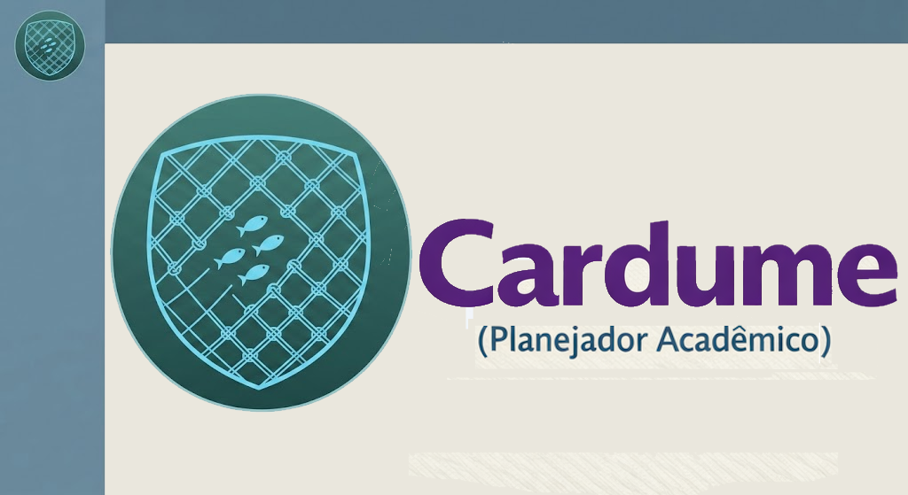

# Cardume - Planejador Academico | IECOS/UFPA



Sistema web para montagem, revisao, auditoria e publicacao de grades academicas do IECOS/UFPA. O app roda no navegador, usa `localStorage` como persistencia local por plano letivo e hoje opera com o motor canonico por faixas ja consolidado na `main`.

Links publicos:
- App principal: `https://astuciasnor.github.io/gestor-iecos/`
- Agenda publica: `https://astuciasnor.github.io/gestor-iecos/agenda_publica.html`

Documentacao tecnica:
- [`docs/manual_desenvolvedor.md`](docs/manual_desenvolvedor.md)

---

## Funcionalidades principais

- **Periodos letivos oficiais:** o seletor lateral consome `periodos_letivos` do `dados_app.json` e preenche automaticamente inicio e fim do plano ativo.
- **Persistencia por plano letivo:** cada combinacao `periodo + inicio + fim` fica isolada no navegador.
- **Grade Semanal como centro operacional:** e o unico lugar para desenhar slots e definir regimes de funcionamento.
- **Motor canonico por faixas:** toda oferta e tratada por datas, slots e execucao real, sem depender da UX legada por tipo.
- **Datas das faixas como referencia oficial:** a `Faixa 1` nasce por sugestao automatica, mas a edicao oficial da data e feita pelos mini calendarios das faixas.
- **Turnos e sabado integrados ao motor:** mudancas de turno, sabado de manha e avisos `Atenção Turno` sao refletidos na Grade Semanal, calendarios, agendas e Gantt.
- **Gantt bidimensional por docente:** leitura temporal mais clara, com turnos reais, detalhes de barra e mesma base de execucao usada nos calendarios.
- **Agenda publica:** `agenda_publica.html` e a pagina oficial de publicacao das grades.
- **Exportacao, SIGAA e publicacao online:** backup, exportacao institucional e `alocacoes_publicas.json` partem do plano ativo.
- **Base inicial de testes automatizados:** a suite `tests/academic_rules.test.mjs` cobre o nucleo atual do motor canonico.

---

## Fluxo de uso

### 1. Configuracao inicial

1. Abra o sistema no navegador.
2. Selecione o **Periodo Letivo** oficial na lateral. O app preenche automaticamente as datas de inicio e fim.
3. Escolha o **Turno**, depois o **Curso** e a **Turma**.

### 2. Montagem da grade

1. Selecione a componente, a cor e o(s) docente(s) na lateral.
2. Va para a aba **Grade Semanal**.
3. Defina o inicio da `Faixa 1` pelo mini calendario da tabela de faixas.
4. Desenhe os slots diretamente na grade.
5. Se o regime mudar ao longo do periodo, crie a `Faixa 2` ou `Faixa 3` e desenhe explicitamente o novo padrao.
6. Clique em **Salvar Componente**.

Observacoes importantes:
- o clique na grade desenha horarios, mas nao deve empurrar a data oficial da `Faixa 1`;
- a data inicial sugerida para uma nova componente pode vir do primeiro dia livre apos a ultima alocacao valida da turma;
- se a sugestao nao servir, ajuste a data diretamente no calendario da faixa.

### 3. Revisao e auditoria

- Use a aba **Lista de Ofertas** para revisar, editar ou excluir ofertas.
- Use **Calendario da Turma**, **Calendario Docente** e **Grafico Gantt** para leitura e auditoria.
- Quando aparecer o aviso de turno, ele indica que aquela aula ocorre excepcionalmente em um turno diferente do turno nativo da turma.

### 4. Publicacao e exportacoes

- **Exportar JSON:** gera backup do plano letivo ativo.
- **Importar JSON:** restaura ou mescla dados no contexto do plano selecionado.
- **Exportar Metadados SIGAA:** gera o payload institucional do plano ativo.
- **Publicar Online:** prepara o arquivo publico para as agendas.

---

## Modelo canonico

### Faixa

Faixa significa:

> **regime de funcionamento em um intervalo de datas**

Regras operacionais:

- a nova faixa substitui a faixa anterior a partir de sua data de inicio;
- o fim da faixa anterior e ajustado automaticamente;
- os slots da nova faixa so existem se forem desenhados pelo usuario;
- o calculo de CH, conflitos, calendario, Gantt e exportacoes parte da execucao real gerada por essas faixas.

### Conflitos

Um conflito real existe somente quando houver, ao mesmo tempo:

1. sobreposicao de periodo;
2. sobreposicao de dia da semana;
3. sobreposicao de slot.

Formula:

`conflito = overlap(periodo) AND overlap(dia) AND overlap(slot)`

---

## Dados e manutencao

O arquivo `dados_app.json` e gerado a partir de `dados/planilha_base.xlsx` pelo script:

```bash
python tools/convert_data.py
```

Abas principais esperadas no Excel:

- `docentes`
- `componentes`
- `turmas`
- `cursos`
- `horarios`
- `feriados`
- `periodos_letivos`

A aba `periodos_letivos` e a fonte oficial dos periodos institucionais. Exemplo:

| ano | periodo_letivo | inicio | fim |
|---|---|---|---|
| 2026 | PL1 | 05/01/2026 | 06/03/2026 |
| 2026 | PL2 | 23/03/2026 | 23/07/2026 |

Observacoes:

- o app nao depende mais de datas padrao escritas manualmente no `index.html`;
- o seletor lateral consome os periodos oficiais gerados no JSON;
- `horarios_por_turno` e a base para Grade Semanal, calendarios e Gantt.

---

## Publicacao online

Fluxo recomendado:

1. No app, clique em **Publicar Online**.
2. No terminal, execute:

```bash
python tools/publish_online.py
```

3. Se quiser publicar no GitHub Pages no mesmo fluxo:

```bash
python tools/publish_online.py --push
```

Arquivos e paginas envolvidos:

- `alocacoes_publicas.json`
- `agenda_publica.html`
- `agenda_discente.html`
- `publicacoes/publicacao_config.json`
- `publicacoes/catalogo_publicacoes.json`

Hoje a publicacao segue no modo legado de arquivo unico, com preparacao interna para evolucao futura por plano letivo.

---

## Testes

Suite automatizada principal do nucleo canonico:

```bash
node --test tests/academic_rules.test.mjs
```

Uso recomendado nas limpezas graduais:

1. rodar a suite automatizada;
2. testar `index.html`;
3. testar `agenda_publica.html`;
4. testar `agenda_discente.html`;
5. so entao remover ou consolidar arquivos de baixo risco.

---

## Estado atual

Diretrizes ja consolidadas:

- motor canonico por faixas em producao;
- mudancas de turno funcionando no app e nas agendas;
- Gantt bidimensional validado;
- agendas publica e discente funcionando em desktop e celular;
- publicacao online validada com `publish_online.py`;
- agenda discente legada preservada durante a transicao;
- limpezas e remocoes devem continuar em ciclos pequenos, sempre com teste e commit.
