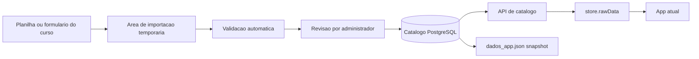
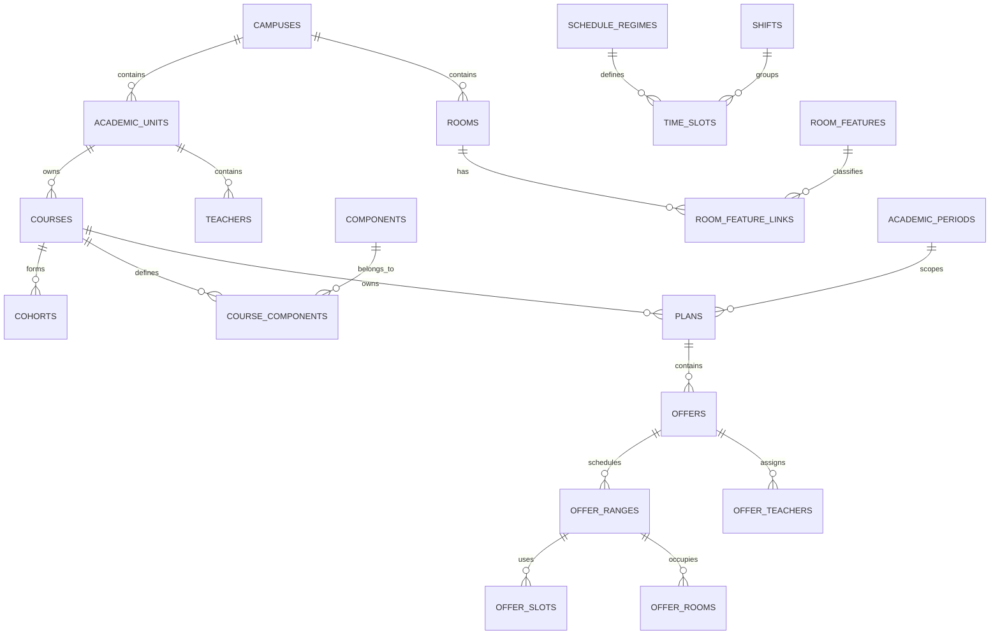

# Plano de evolucao para banco de dados e cadastro institucional

## 1. Resumo executivo

O Cardume ja chegou ao ponto em que vale preparar um banco de dados, mas nao e
recomendado migrar tudo de uma vez.

Hoje existem dois tipos de dados com necessidades diferentes:

1. **Catalogo institucional compartilhado**: cursos, docentes, componentes,
   turmas, turnos, horarios, periodos letivos e, futuramente, salas.
2. **Planejamento operacional**: ofertas e alocacoes montadas por periodo
   letivo, hoje persistidas no `localStorage`.

A primeira migracao deve centralizar o **catalogo institucional**. As alocacoes
podem continuar locais durante a fase inicial e migrar depois que autenticacao,
permissoes, auditoria e backups estiverem consolidados.

Recomendacao de tecnologia para a primeira versao:

- **PostgreSQL gerenciado pelo Supabase**;
- autenticacao e API REST fornecidas pelo Supabase;
- importador e validador em Python, aproveitando `openpyxl` ja usado no projeto;
- frontend continua estatico no GitHub Pages durante a transicao;
- `dados_app.json` continua sendo gerado como snapshot/backup compativel.

Essa escolha reduz a quantidade de infraestrutura que a equipe precisaria
administrar. O modelo continua sendo PostgreSQL padrao e pode ser migrado para
outro provedor ou para uma API propria no futuro.

## 2. O que o banco resolve

- uma fonte unica para todos os cursos do campus;
- inclusao de novos cursos sem editar manualmente um JSON global;
- cadastro persistente de novos docentes;
- catalogo de salas, capacidades e recursos;
- atualizacoes visiveis por mais de uma coordenacao;
- historico de quem alterou cada cadastro;
- validacao antes de publicar dados enviados por um curso;
- backups centrais e recuperacao de versoes;
- base futura para planejamento colaborativo.

O banco nao deve ser introduzido apenas para substituir arquivos. Ele deve vir
com identificadores estaveis, regras de integridade, permissoes e auditoria.

## 3. Estrategia de transicao



Durante a transicao, o frontend deve receber o mesmo formato que ja recebe de
`dados_app.json`. Isso permite trocar a fonte sem alterar imediatamente dezenas
de consumidores de `store.rawData`.

Fluxo temporario recomendado em `store.loadData()`:

1. tentar carregar o catalogo pela API;
2. validar a versao e o formato da resposta;
3. em caso de indisponibilidade, usar o ultimo snapshot local;
4. manter `dados_app.json` como fallback somente leitura;
5. continuar carregando alocacoes do plano pelo mecanismo atual.

## 4. Modelo de dados inicial

### 4.1. Entidades principais

| Entidade | Campos essenciais | Observacoes |
|---|---|---|
| `campuses` | `id`, `code`, `name`, `active` | Prepara expansao alem de um campus. |
| `academic_units` | `id`, `campus_id`, `code`, `name` | Unidade e subunidade institucional. |
| `courses` | `id`, `unit_id`, `code`, `name`, `regime_id`, `active` | `code` corresponde a siglas como EP, CB. |
| `teachers` | `id`, `name`, `nickname`, `unit_id`, `email`, `active` | Nome normalizado para evitar duplicidade. |
| `components` | `id`, `code`, `name`, `short_name`, `workload`, `color`, `active` | Componente institucional, sem depender do curso. |
| `course_components` | `course_id`, `component_id`, `curriculum_period`, `required` | Relacao N:N entre curso e componente. |
| `cohorts` | `id`, `course_id`, `entry_year`, `shift_id`, `label`, `active` | Equivale as turmas atuais. |
| `shifts` | `id`, `code`, `name` | Manha, tarde, noite e combinacoes. |
| `schedule_regimes` | `id`, `code`, `name`, `valid_from`, `valid_to` | Regimes de horario por vigencia. |
| `time_slots` | `id`, `regime_id`, `shift_id`, `position`, `start_time`, `end_time`, `sigaa_code`, `is_break` | Substitui as faixas textuais de horario. |
| `academic_periods` | `id`, `year`, `code`, `start_date`, `end_date`, `status` | PL1 a PL4 e periodos futuros. |
| `rooms` | `id`, `campus_id`, `code`, `name`, `capacity`, `room_type`, `active` | Cadastro fisico de salas. |
| `room_features` | `id`, `code`, `name` | Projetor, laboratorio, acessibilidade etc. |
| `room_feature_links` | `room_id`, `feature_id` | Recursos disponiveis por sala. |

### 4.2. Planejamento, em fase posterior

| Entidade | Objetivo |
|---|---|
| `plans` | Plano de um curso em um periodo letivo. |
| `offers` | Oferta de uma componente para uma turma. |
| `offer_teachers` | Docentes e parcelas de CH da oferta. |
| `offer_ranges` | Faixas de vigencia da oferta. |
| `offer_slots` | Dias e horarios de cada faixa. |
| `offer_rooms` | Sala atribuida por faixa ou ocorrencia. |
| `plan_versions` | Versoes publicadas ou restauraveis do plano. |

### 4.3. Importacao e auditoria

| Entidade | Objetivo |
|---|---|
| `import_batches` | Um envio de planilha ou JSON, com autor e status. |
| `import_rows` | Linhas normalizadas, erros e avisos de cada envio. |
| `audit_log` | Quem criou, alterou, aprovou ou desativou um registro. |

### 4.4. Relacionamentos



## 5. Regras importantes do modelo

1. Usar UUID como chave interna e codigos legiveis como chaves de negocio.
2. Nao usar nome de docente, curso ou componente como chave estrangeira.
3. Registros usados em planos antigos nao devem ser excluidos: devem receber
   `active = false`.
4. `courses.code`, `components.code`, `rooms(campus_id, code)` e
   `academic_periods(year, code)` devem ser unicos.
5. Docentes devem ter um campo de nome normalizado para detectar duplicidades.
6. Capacidade de sala deve ser inteira e nao negativa.
7. Sala e turma devem pertencer ao mesmo campus quando forem associadas.
8. Sobreposicao de sala deve ser detectada pelo mesmo principio atual de
   conflitos: periodo, data/dia e slot.
9. Toda alteracao aprovada deve registrar autor, data e valores anteriores.

## 6. Cadastro estruturado de um novo curso

### 6.1. Formato inicial recomendado

Manter uma planilha `.xlsx` padronizada e versionada, pois esse formato ja e
familiar para as coordenacoes e o projeto ja usa `openpyxl`.

Abas sugeridas:

- `curso`: sigla, nome, unidade, campus, regime;
- `docentes`: nome, apelido, unidade, email;
- `componentes`: codigo, nome, abreviacao, CH, periodo curricular;
- `turmas`: ano de entrada, turno, rotulo;
- `salas`: codigo, nome, capacidade, tipo, recursos;
- `horarios`: regime, turno, ordem, inicio, fim, codigo SIGAA;
- `responsaveis`: nome, email e funcao de quem enviou;
- `metadados`: versao do modelo e data de preenchimento.

Tambem deve existir um formato JSON equivalente para integracoes futuras. O
JSON precisa ter um `schemaVersion`, por exemplo:

```json
{
  "schemaVersion": 1,
  "course": {},
  "teachers": [],
  "components": [],
  "cohorts": [],
  "rooms": [],
  "schedules": []
}
```

### 6.2. Fluxo de submissao

1. Curso baixa o modelo oficial da planilha.
2. Curso preenche e envia pelo painel "Cadastrar curso".
3. Arquivo entra em `import_batches` com status `uploaded`.
4. Importador normaliza acentos, espacos, datas, codigos e turnos.
5. Validador apresenta erros e avisos por aba, linha e coluna.
6. Usuario corrige o arquivo ou confirma os avisos permitidos.
7. Administrador visualiza um resumo das inclusoes e alteracoes.
8. Administrador aprova ou rejeita o lote.
9. Aprovacao grava tudo em uma unica transacao no banco.
10. O sistema gera nova versao do catalogo e um snapshot `dados_app.json`.

O envio nunca deve escrever diretamente nas tabelas oficiais. Essa area de
staging evita que uma planilha incompleta quebre o app em producao.

### 6.3. Validacoes minimas

- sigla de curso obrigatoria e unica;
- codigo da componente obrigatorio e unico dentro do contexto definido;
- CH inteira positiva;
- docente com nome completo;
- deteccao de docente possivelmente duplicado;
- turno existente ou explicitamente proposto;
- inicio do slot anterior ao fim;
- slots do mesmo regime sem sobreposicao;
- sala com campus, codigo, capacidade e tipo validos;
- recursos de sala vindos de um vocabulario controlado;
- referencia a unidade, curso e regime existente no mesmo lote ou no banco;
- nenhuma linha silenciosamente descartada.

## 7. Papeis e permissoes

| Papel | Permissoes |
|---|---|
| `viewer` | Consulta catalogo e agendas publicadas. |
| `course_editor` | Envia e corrige dados do proprio curso. |
| `course_coordinator` | Mantem catalogo do curso e seus planos em rascunho. |
| `campus_admin` | Aprova cursos, docentes, salas e periodos. |
| `system_admin` | Configura usuarios, vocabularios e integracoes. |

No Supabase, essas regras devem ser aplicadas com Row Level Security. O
frontend nao pode confiar apenas em esconder botoes.

## 8. API e compatibilidade

Endpoints iniciais, independentemente da tecnologia escolhida:

```text
GET  /catalog/snapshot
GET  /courses
GET  /teachers?search=...
GET  /components?course=EP
GET  /rooms?campus=...
POST /imports
GET  /imports/{id}/validation
POST /imports/{id}/submit
POST /imports/{id}/approve
POST /imports/{id}/reject
```

`GET /catalog/snapshot` deve devolver, inicialmente, o contrato compativel com
`dados_app.json`. Esse endpoint e a ponte que reduz o risco da migracao.

## 9. Fases de implementacao

### Fase 0 - contrato e qualidade dos dados (1 a 2 semanas)

- documentar o schema atual de `dados_app.json`;
- definir IDs, codigos unicos e regras de normalizacao;
- adicionar aba `salas` opcional ao conversor atual;
- criar planilha modelo de cadastro de curso;
- criar validador que nao grava nada e gera relatorio de erros;
- adicionar testes do conversor e do validador.

**Entrega verificavel:** uma planilha de curso pode ser validada e convertida
para JSON sem alterar o app.

### Fase 1 - prototipo de banco (1 a 2 semanas)

- criar projeto Supabase de desenvolvimento;
- aplicar migracoes SQL das entidades de catalogo;
- importar a planilha institucional atual;
- conferir contagens e chaves com `dados_app.json`;
- configurar backup e ambientes separados de desenvolvimento/producao.

**Entrega verificavel:** banco reproduz integralmente o catalogo atual.

### Fase 2 - API compativel e fallback (1 semana)

- implementar `/catalog/snapshot`;
- adaptar `store.loadData()` para API com fallback JSON;
- exibir versao e data do catalogo carregado;
- manter alocacoes no `localStorage`;
- testar app principal e agenda publica contra as duas fontes.

**Entrega verificavel:** desligar a API nao impede o uso com o snapshot local.

### Fase 3 - importacao assistida de cursos (2 a 3 semanas)

- disponibilizar planilha modelo;
- implementar upload, staging e validacao;
- criar tela de pre-visualizacao de diferencas;
- implementar aprovacao por administrador;
- gerar auditoria e novo snapshot apos aprovacao.

**Entrega verificavel:** um curso novo entra por planilha, passa por revisao e
aparece no app sem editar arquivos manualmente.

### Fase 4 - salas e conflitos de espaco (2 semanas)

- habilitar cadastro de salas e recursos;
- incluir sala nas ofertas/faixas;
- filtrar salas por capacidade, tipo e recurso;
- detectar sobreposicao de sala;
- incluir sala nos calendarios e exportacoes.

**Entrega verificavel:** o sistema impede ou sinaliza duas aulas na mesma sala,
data e horario.

### Fase 5 - planejamento colaborativo (3 a 5 semanas)

- migrar planos e ofertas do `localStorage` para o banco;
- adicionar rascunho, publicacao e versoes;
- implementar controle de concorrencia para duas coordenacoes;
- manter exportacao JSON como backup portavel;
- migrar planos locais somente com confirmacao e relatorio.

**Entrega verificavel:** duas pessoas autorizadas veem a mesma versao do plano
e nenhuma sobrescreve silenciosamente o trabalho da outra.

## 10. O que nao fazer agora

- nao migrar catalogo e alocacoes na mesma entrega;
- nao permitir escrita anonima no banco;
- nao cadastrar docente novo apenas porque um nome foi digitado no filtro;
- nao remover `dados_app.json` antes de validar o fallback;
- nao ligar o frontend diretamente a tabelas sem RLS;
- nao aceitar planilha sem staging, validacao e revisao;
- nao guardar senhas ou chaves administrativas no JavaScript publicado;
- nao modelar salas como texto livre dentro da oferta.

## 11. Primeira entrega recomendada

A primeira entrega deve ser pequena e independente do banco:

1. adicionar `salas` como aba opcional em `convert_data.py`;
2. criar `dados/modelo_cadastro_curso.xlsx`;
3. criar `tools/validate_course_import.py`;
4. gerar relatorio JSON com erros, avisos e contagens;
5. criar testes com uma planilha valida e uma invalida;
6. definir o schema SQL somente depois que o formato de entrada estiver
   validado com pelo menos um curso real.

Esse passo reduz o risco principal: construir um banco em torno de dados ainda
nao padronizados.

## 12. Criterios para decidir o inicio da Fase 1

Iniciar o banco quando estas respostas forem "sim":

- existe uma pessoa responsavel por aprovar cadastros;
- existe um modelo de planilha aceito pelos cursos;
- codigos unicos de cursos, componentes e salas foram definidos;
- esta claro quem pode ver e alterar cada dado;
- ha uma politica minima de backup e recuperacao;
- pelo menos um cadastro real passou pelo validador;
- a equipe aceita manter um ambiente de desenvolvimento separado da producao.

## 13. Decisao recomendada

Comecar agora pela **Fase 0**. Em paralelo, pode-se criar um prototipo Supabase
somente de desenvolvimento, sem conectar o app de producao. Ao final da Fase 0,
o modelo do banco sera baseado em dados validados e a migracao podera ocorrer
sem interromper o fluxo atual das coordenacoes.